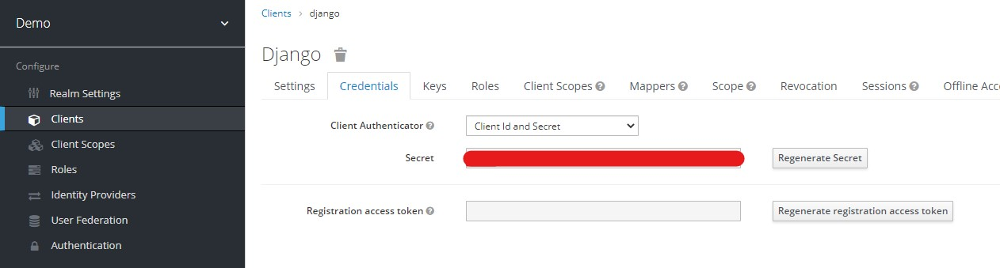
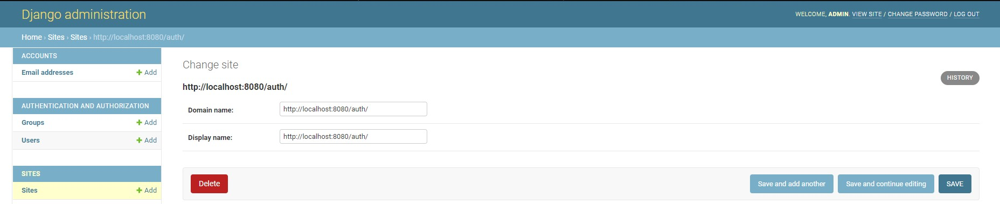
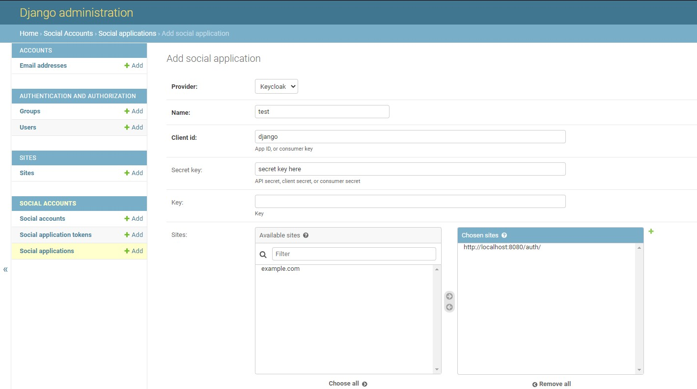

1. Dowload keycloak https://github.com/keycloak/keycloak/releases/download/15.0.2/keycloak-15.0.2.zip
2. Start keycloak:\
win - `bin/standalone.bat`\
linux - `bin/standalone.sh`
3. Create admin account - https://www.keycloak.org/docs/latest/getting_started/#creating-the-admin-account
4. Create realm and user - https://www.keycloak.org/docs/latest/getting_started/#creating-a-realm-and-a-user  
Realm name - `demo`
5. Create client - https://www.keycloak.org/docs/latest/server_admin/#_oidc_clients
5.1  
Client ID - `django`  
Client Protocol - `openid-connect`  
Root URL - `http://127.0.0.1:8000`  
5.2 Client Settings Valid Redirect URIs - http://127.0.0.1:8000/*
5.3 Copy Secret from Credential tab

6. Download project - git clone https://github.com/dementevm/django-allauth.git
7. Create venv - `py -m venv venv`
8. Activate venv:\
win - `venv\Scrits\activate`\
linux - `source venv/bin/activate`
9. Install requirements - `pip install -r requirements.txt`
10. Make migrations - `py manage.py migrate`
11. Create superuser - `py manage.py createsuperuser`
12. Log in to admin console and add site

Domain name: - http://localhost:8080/auth/  
Display name: - http://localhost:8080/auth/
13. Add social app: `http://127.0.0.1:8000/admin/`

Provider - Keycloak
Name - test
Client id - django
Secret key - From 5.3
Key - blank
Sites - http://localhost:8080/auth/
14. Run server - `py manage.py runserver`
